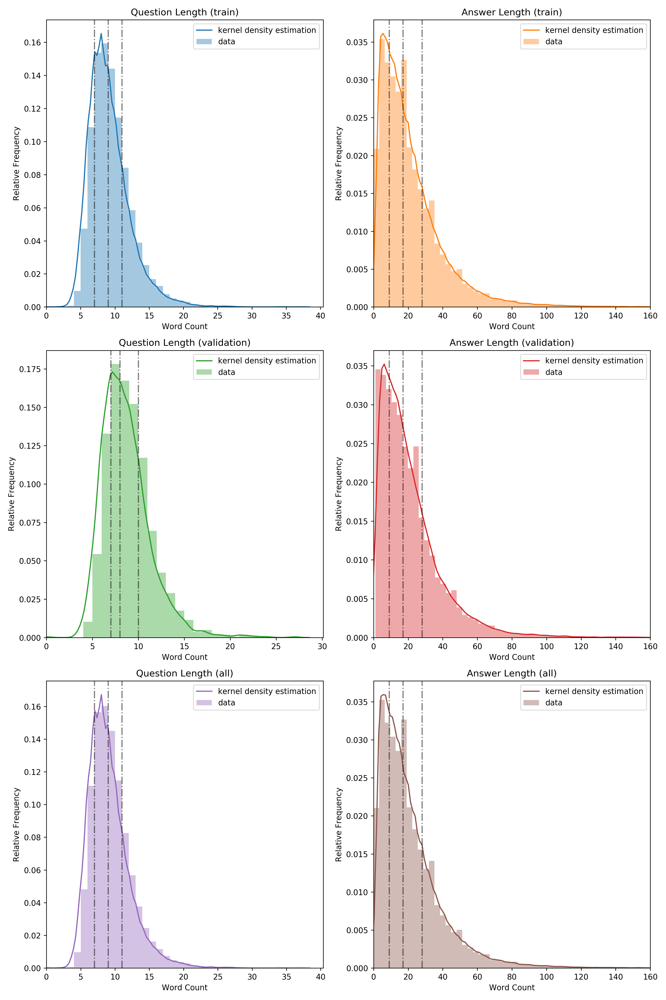
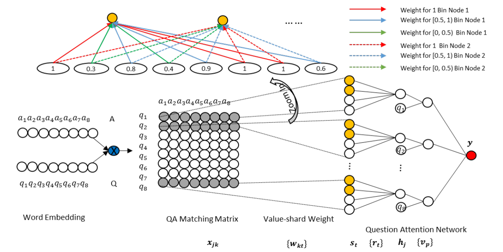
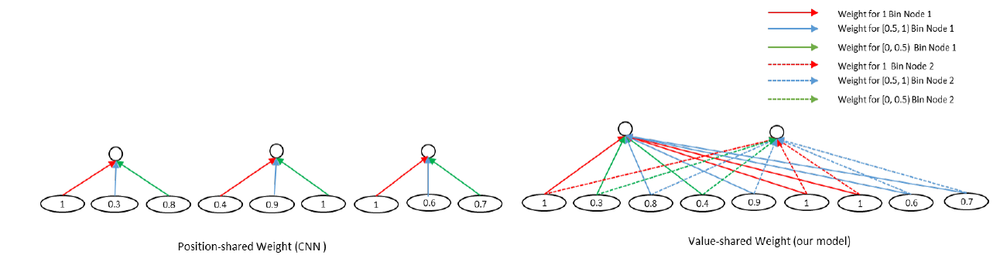
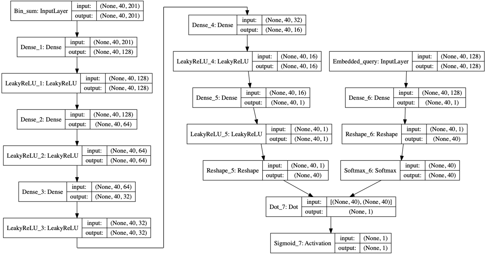
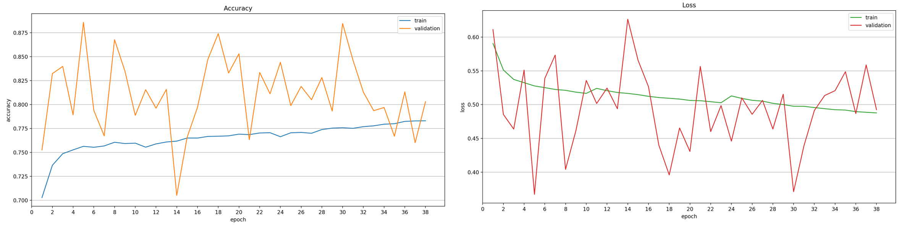

# 基于文档的自动问答系统

潘学海 1500011317 杨纪翔 1500011342 杜尚宸 1600012782 曾 皓 1600012955

---
<!-- @import "[TOC]" {cmd="toc" depthFrom=1 depthTo=6 orderedList=false} -->

<!-- code_chunk_output -->

* [基于文档的自动问答系统](#基于文档的自动问答系统)
	* [问题概述](#问题概述)
	* [模型概述](#模型概述)
		* [问题-回答匹配矩阵(QA Matching Matrix)](#问题-回答匹配矩阵qa-matching-matrix)
		* [价值共享的权重(Value-shared Weight)](#价值共享的权重value-shared-weight)
		* [问题注意力网络(Question Attention Network)](#问题注意力网络question-attention-network)
	* [代码实现](#代码实现)
	* [训练结果及验证集表现](#训练结果及验证集表现)
	* [附录](#附录)
		* [编译/运行环境](#编译运行环境)
		* [分工情况](#分工情况)
		* [参考文献](#参考文献)

<!-- /code_chunk_output -->
## 问题概述
我们试图建立一个模型，判断给定的一段话是不是一个问题的答案。可供使用的训练集和验证集的每条数据均由两个句子和一个标签组成。样例如下：

> 陈红研究什么的？	陈红，女，1972年4月出生，管理学博士，教授、经济与管理学院副院长。	0
> 陈红研究什么的？	研究方向：战略管理、知识与技术管理。	1
> 陈红研究什么的？	陈红，女，1972年4月出生，管理学博士，教授、经济与管理学院副院长。	0
> 陈红研究什么的？	陈红战略管理、知识与技术管理。	0
> 陈红研究什么的？	主要讲授《现代管理学》、《西方经济学》《人力资源管理》、《市场营销》、《战略管理》等课程。	0
> 陈红研究什么的？	发表学术论文30余篇，主持省级研究项目十余项，主持或做为第二负责人参加的科研项目有四项通过省科技厅组织的评审，三项为国内领先水平，一项为国内先进水平。	0
> 陈红研究什么的？	做为第二负责人参加的教学研究课题《工商管理学科实习与实践环节的教学改革》获山西省教学成果二等奖。	0

在进行建模之前，我们对数据进行了预处理，检查了问题和答案的长度分布，如下图所示（注：test集的数据是最后更新的，建模时未作参考，但不影响结果）。绝大多数的问题的长度在15个词以下，回答的长度在60词以下。为平衡训练的质量和效率，我们最后选择了问题的截断长度为40词，答案的截断长度为160词。此外，大多数问题有30条回答，我们猜测这是数据发布者人为选择的结果。

图1: 数据预处理

## 模型概述
对于Question Answering(QA)问题，除了传统的feature engineering，也可以使用深度学习方法进行实现。但使用卷积神经网络(CNN)或长短期记忆(LSTM)方法构建模型时，往往需要使用额外的特征进行辅助，否则效果会很不好。因此，在本课题中，我们参考相关文献[1]，实现了一个aNMM (attention-based Nerual Matching Model)模型，对问答结果进行分析。以下作简要介绍。

图2: aNMM模型网络结构[1]

### 问题-回答匹配矩阵(QA Matching Matrix)

文字处理任务中，将词语转化为词向量是很常规的一步(Word Embedding)。在这之后，我们面对的问题是如何将一个问题和一个答案的两组词向量联系起来。这里采用的方法是构建问题-回答匹配矩阵(QA Matching Matrix)，即将问题中的每一个词和回答中的每一个词的一一比较，矩阵元即为其相似度。相似度函数为`cos`函数，若问题中的词$q_j$和回答中的词$a_k$完全相同则相似度为1。即

$$x_{jk}=\cos (<\vec q_j,\vec x_k>)=\frac{\vec q_j\cdot \vec x_k}{|\vec q_j|\cdot|\vec x_k|}$$

### 价值共享的权重(Value-shared Weight)
传统神经网络如CNN本身是为图像处理而设计的，因此它的主要特点是，每一个filter总是处理临近的若干数据点，因此原数据集中相邻位置的点会共享相同的网络权重(position-shared weight)。
而在自然语言中，由于语法句式的复杂多样，重要信息可以出现在句子的每一个位置，基于位置的filter很难提取特征。因此我们给价值相似的词赋予相同的权重连入网络(value-shared weight)，会有更好的结果。这里的价值就是在上面定义的问题词和答案词之间的相似度。即$$h_j=\delta(\sum_{k=0}^{K}w_k\cdot x_{jk})$$这里$h_j$表示第$j$个节点的输出，采用`sigmoid`激活函数，$w_k$表示第$k$个价值区间对应的权重。每一个价值区间，如下图中的$[0,0.5)$、$[0.5,1)$和${1}$，分别称为一个容器(bin)。

图3: 位置共享权重(CNN)和价值共享权重(aNMM)的比较[1]

### 问题注意力网络(Question Attention Network)
传统方法的另一问题是，对于问题中的哪个词比较重要这件事并没有特别的关注。看以下这个例子：
> ==内迪尔科==参加==欧洲冠军联赛==的==赛况==如何？

显然，句子中有一些词比另一些词更加关键，因此应当在结果中更加关注这些词对应的输出。在本模型中，我们在输出层之前加入一层网络，问题中的每个词对应一个`softmax`门函数来控制对应的网络输出，网络需要训练参数使得门函数挑出那些比较重要的词。具体来说如下式所示

$$y=\sum_{j=1}^M{g_j\cdot h_j}=\sum_{j=1}^M{\frac{\exp(\bold{v}\cdot\bold{q_j})}{\sum_{l=1}^L\exp(\bold{v}\cdot\bold{q_l})}}\cdot h_j$$

式中的$\bold{v}$是一个模型参量，通过训练达到最优化。

## 代码实现
对于数据我们首先进行分词处理，这一部分调用开源库`jieba`完成。然后我们对分词后的结果进行词向量构建，词向量维度为128，这一部分主要调用` gensim.models.Word2Vec`完成。
之后可以构建QA Matching Matrix。根据相似度我们将$[-1,1]$区间分为201个bin。为了加快模型训练速度，并不把构建完的矩阵直接传入网络，而是首先进行预处理，将每行中属于不同bin的矩阵元分别求和，即bin_sum输入网络。
输入的bin_sum会经过五层`Dense`+`LeakyReLU`全连接网络，每层的节点数逐次减少，最后一层输出值即为前述的$h_j$。这里最初还有`Dropout`层，但在实际训练过程中发现，引入`Dropout`层会使训练极不稳定，最终将其删去。
另一方面，将问题中每个词的词向量通过一个`Dense`层（即上述模型参量$\bold v$），再通过`softmax`门函数，和对应网络输出进行点乘，最后通过`sigmoid`激活函数输出。
具体网络模型如下图所示：

图4: 网络具体结构及各部分数据维度

## 训练结果及验证集表现
在训练过程中，我们首先发现，由于负例数量远远大于正例数量（约为20比1），即绝大多数回答都是错误的，因此网络只需直接输出负例即可获得很高的正确率。因此我们将正例复制到和负例一样多，这样可以部分缓解这一困难。
此后，我们总计进行了36轮训练，训练集和验证集的准确率和Loss值的变化如下图所示。训练集的准确率随训练轮次上升，但验证集的准确率起伏较大，没有明显变化趋势。

图5: 训练集和验证集的准确率和Loss值随训练轮数的变化

随后，我们又利用提供的工具`evaltool`对验证集进行了评测，评测指标是Mean Average Presicion(MAP)和Mean Reciprocal Rank(MRR)。评测结果如下图所示，随训练轮数有明显上升。

图6: 验证集上MAP和MRR随训练轮数的变化

## 附录
### 编译/运行环境
+ 全部代码在`Python 3.6`环境下编译，使用到的主要的开源库及其版本如下：
	+ Tensorflow 1.12.0
	+ Keras 2.2.4
	+ jieba 0.39
	+ gensim 3.6.0
+ 模型的训练环境是i7-8700K + Titan V + 16G RAM

### 分工情况
+ 方法及模型由四人集体讨论完成
+ 训练代码主要由潘学海、杜尚宸完成，模型的训练和预测由潘学海、杜尚宸、杨纪翔进行
+ 评测代码主要由曾皓完成
+ 结题报告由杨纪翔完成，展示幻灯片由杜尚宸完成

### 参考文献
1. Yang L, Ai Q, Guo J, et al. aNMM: Ranking short answer texts with attention-based neural matching model[C]//Proceedings of the 25th ACM International on Conference on Information and Knowledge Management. ACM, 2016: 287-296.
